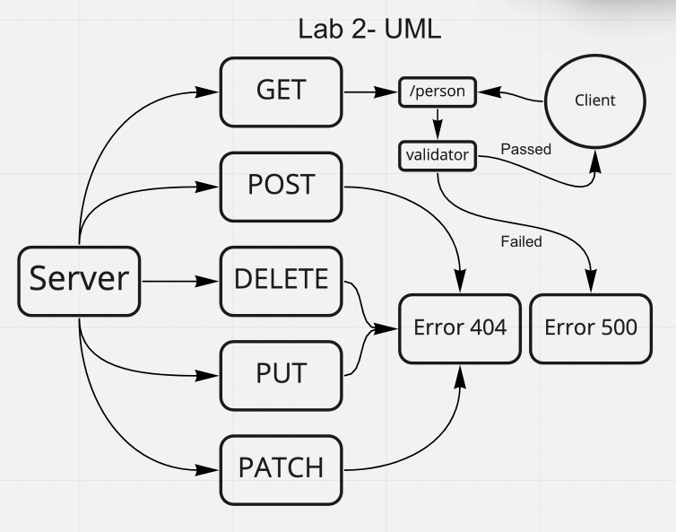

# basic-express-server

## Author

Antoine Charette

## Summary of Problem Domain

## Links to Application Deployment

[Heroku](https://code401-basic-express-server.herokuapp.com/)

[Actions Page](https://github.com/DevAOC/basic-express-server/actions/new)

[PR](https://github.com/DevAOC/basic-express-server/pull/1)

## Include Embedded UML

## Routes

- HTTP GET

  - Path: /person
    - Response with the name passed in the query string.
