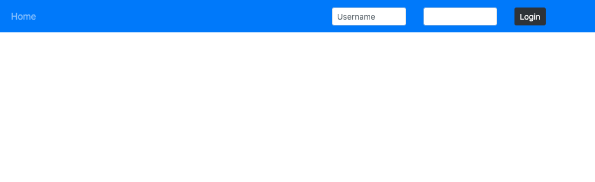
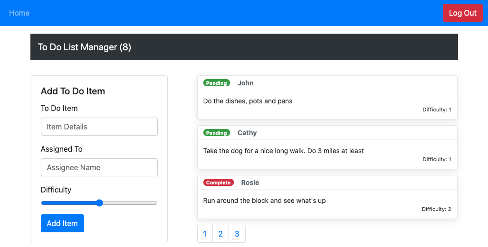

k# LAB -  `<Login />` and `<Auth />`

**To Do List Manager Phase 3:** Adding security and access controls to the application.

In this final phase, we'll be requiring that users be logged in, in order to see the to do items. Additionally, based on their user type, they will be allowed (or denied) to perform actions such as editing or deleting them.

## Before you begin

Refer to *Getting Started*  in the [lab submission instructions](../../../reference/submission-instructions/labs/README.md) for complete setup, configuration, deployment, and submission instructions.

> Building off of your previous day's branch, create a new branch for today called 'auth' and continue to work in your 'todo' repository.

## Business Requirements

Refer to the [To Do System Overview](../../apps-and-libraries/todo/README.md) for a complete review of the application, including Business and Technical requirements along with the development roadmap.

## Phase 3 Requirements

In Phase 3, we'd like to extend the functionality of the application by requiring users be logged in to view items and also restrict access based on user type. The user stories from **Phases 1, and 2** remain unchanged. For this phase, we are now adding the following new user stories.

- As a user, I want to provide a way for other users to create new accounts
- As a user, I want to provide a way for all users to login to their account
- As a user, I want to make sure that my To Do items are only viewable to users that have logged in with a valid account.
- As a user, I want to ensure that only fellow users that are allowed to "create", based on their user type, can add new To Do Items
- As a user, I want to ensure that only fellow users that are allowed to "update", based on their user type, can mark To Do Items complete
- As a user, I want to ensure that only fellow users that are allowed to "delete", based on their user type, can delete new To Do Items

Logged-Out User:

Logged-In User:

## Technical Requirements / Notes

> Technical requirements for the core application are unchanged from the prior phases, with the addition of an Authentication Context Provider and Components that consume the Context Values and Behaviors.

1. Implement a Login/Auth React Context, "protect" the To Do application by restricting access to the various application features based on the users' login status and capabilities.
   - Define a function that can simulate a `login` event.
     - Parameters: username and password as strings.
     - Sets a `User` on the auth context, and changes login status to `true`.
   - Define a function that can simulate a `logout` event.
     - Resets the `User` object and changes login status to `false.
   - Define a function that can `authorize` a User based on a capabilty.
     - Parameters: a capability as a string.
     - Returns a boolean whether the `user` has the capabililty parameter.

1. Create an `<Auth />` component with the following features:
   - Given a capability prop of type string, conditionally render components based on the `user` stored in `context`.
   - **Hide the entire interface until the user has logged in.**
   - **Implements the following RBAC rules:**
     - Logged In Users with 'read' permissions can see the summary/count.
     - Logged In Users with 'read' permissions can see the list of To Do Items.
     - Logged In Users with 'update' permissions can click the records to mark them as complete.
     - Logged In Users with 'create' permissions can create new items.
     - Logged In Users with 'delete' permissions can delete items.

1. Implement a `<Login />` Component that has the following features:
   - Provide an account login screen with a form.
     - Accepts Username and Password
     - On successful login, store the token as a cookie
   - If a user returns and has a valid login cookie, hide the login form and consider them "Logged In"
     - Display a logout button instead of a form if they are "Logged In".

### Tools you will need to complete the above requirements

#### Login/Auth Components and API

You have been provided, in the `starter-code` folder, a sample application built using the `<Login />` and `<Auth />` components built during class. Get this running first, and analyze it. You will need these components to complete the Authentication tasks specified above

- Convert the `auth/context.js` Context Provider to be a function, rather than a class
- Convert the `<Login />`and`<Auth />` components to be implemented as 'function' components instead of 'class' components

Once you have a working practice app, extract the Login Context and relevant components from it and incorporate them into your To Do application, implementing Authentication and Authorization as described in the requirements above

### Testing

- Write unit tests for the Login Context Component
- Write unit tests for the Login/Auth components
  - Hide/Show based on status
- You will need to create some mocking interface to fake a server/login to simulate.
- Tests should assert all behavioral functionality

### Assignment Submission Instructions

Refer to the the [Submitting React Apps Lab Submission Instructions](../../../reference/submission-instructions/labs/react-apps.md) for the complete lab submission process and expectations
