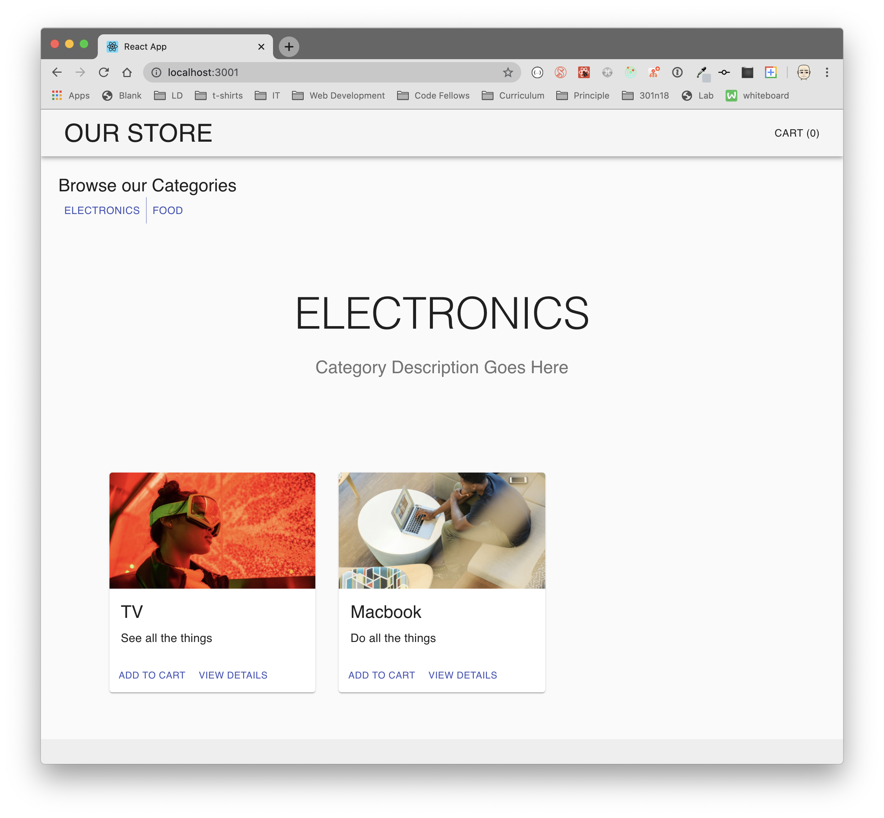

# LAB - Application State with Redux

**Virtual Store Phase 1:** For this assignment, you will be starting the process of creating an e-Commerce storefront using React with Redux, coupled with your live API server

## Before you begin

Refer to *Getting Started*  in the [lab submission instructions](../../../reference/submission-instructions/labs/README.md) for complete setup, configuration, deployment, and submission instructions.

Create a UML diagram of the **Virtual Store** architecture on a whiteboard before you start

> Create a new repository for this project, called 'storefront' and work in a branch called 'redux'

## Business Requirements

Refer to the [Virtual Store System Overview](../../apps-and-libraries/store/README.md) for a complete review of the application, including Business and Technical requirements along with the development roadmap.

## Phase 1 Requirements

Today, we begin the first of a 4-Phase build of the **storefront application**, written in React. In this first phase, our goal is to setup the basic scaffolding of the application with initial styling and basic behaviors. This initial build sets up the file structure and state management so that we can progressively build this application in a scalable manner

The following user/developer stories detail the major functionality for this phase of the project.

- As a user, I expect to see a list of available product categories in the store so that I can easily browse products
- As a user, I want to choose a category and see a list of all available products matching that category
- As a user, I want a clean, easy to use user interface so that I can shop the online store with confidence

## Technical Requirements / Notes

And as developers, here are the high level development tasks that address the above end user requirements

- Create a visually appealing site using [Material UI](https://material-ui.com/)
- Use a Redux Store to manage the state of categories and items in the store
- Display a list of categories from state
- When the user selects (clicks on) a category ...
  - Identify that category as selected (change of class/display)
  - Show a list of products associated with the category

### Application Architecture

Create the Virtual Store application as follows:

- Begin with creating your application using `create-react-app`
- Install Material UI as a dependency
- Write an `App` component that serves as the container for all sub-components of this application
  - A `<Header>` component which shows the name of your virtual store
  - A `<Footer>` component which shows your copyright and contact information
  - A `<Categories>` component
    - Shows a list of all categories
    - Dispatches an action when one is clicked to "activate" it
  - A `<Products>` component
    - Displays a list of products associated with the selected category

### Notes on constructing the Redux Store:

- Categories
  - State should contain a list of categories as well as the active category
    - Each category should have a normalized name, display name, and a description
  - Create an action that will trigger the reducer to change the active category
  - Update the active category in the reducer when this action is dispatched
- Products
  - State should be a list of all products
    - Each product should have a category association, name, description, price, inventory count
  - Create an action that will trigger when the active category is changed
    - HINT: Multiple reducers can respond to the same actions
  - Create a reducer that will filter the products list based on the active category
- Active Category
  - State should store active category
    - Other components (products, etc) might need to reference this

## Testing

Testing for the core behaviors (user stories) of the application is required

## Stretch Goal

- Add another component called `<ActiveCategory />` that appears above the products list that might better inform the user as to the name/description of the currently active category

### Assignment Submission Instructions

Refer to the the [Submitting React Apps Lab Submission Instructions](../../../reference/submission-instructions/labs/react-apps.md) for the complete lab submission process and expectations
