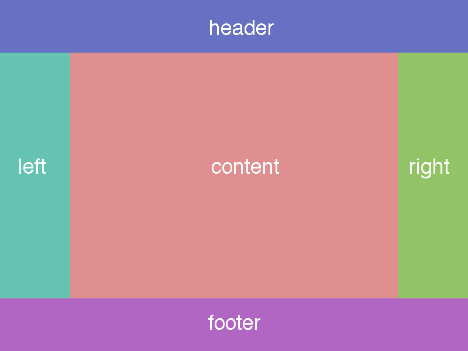

# JavaScript 401 Warm Up - HTML/CSS

## Setup
* Work in a repository for this warmup exercise (`warmup-grail`)
  * On each day, create a new branch of this repo with the date
    * i.e. `11-22-2018`
  * Submit a PR from that branch to your master for review
  * If you are deploying to Heroku or Code Sandbox, provide that link as well.
  * Timebox this to 1 hour

## Warm-Up Exercise

**Before You Start** ... complete the [daily warm-up](../warmup-daily)

Having a fingertips ready scaffold of a core web layout, with responsive rules, using a number of layout tools is essential. Your ability to recognize these common visual patterns and understand what Grid and Flexbox are doing for you should be a stable starting point for any web project.

**Implement a Responsive Holy Grail Layout using Float, Flexbox and CSS Grid. By Hand.**

* You may use a reset.
* Block out all of the sections as shown (no content required)
* Desktop View: Render as shown
* Mobile View: Stack: Header -> Content -> Left -> Right -> Footer
* Header: Add a Horizontal Menu, transform to hamburger

## Assignment Submission Instructions
Refer to the [warmup-instructions.md](../../../reference/submission-instructions/warmups) for the complete lab submission process and expectations
